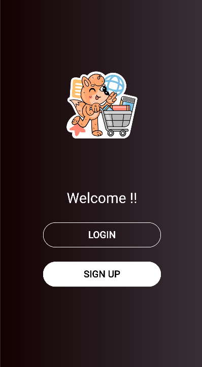
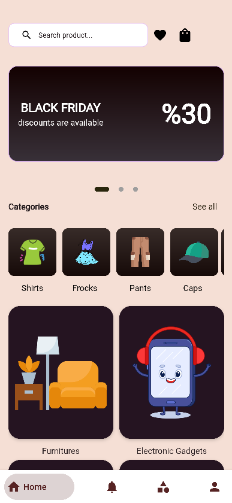
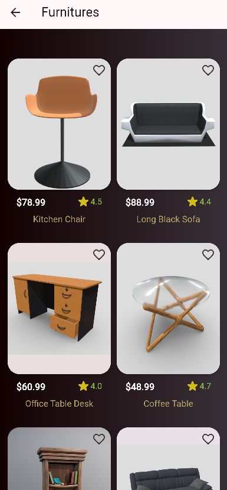
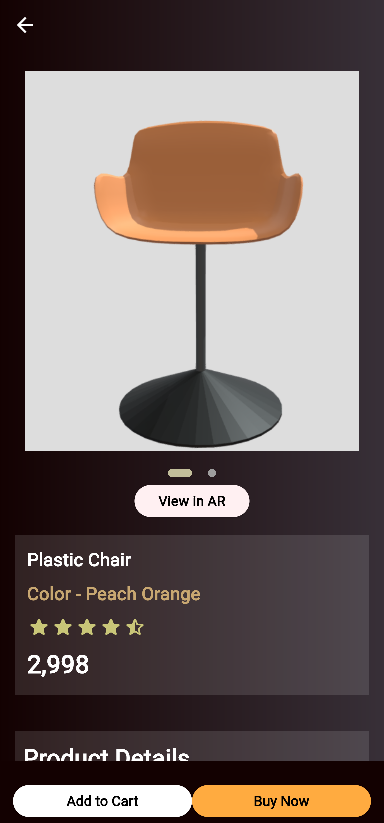

<div align="center">

# 🛒✨ AR-CART

### *Experience Shopping in Augmented Reality*

[](https://flutter.dev)
[](https://dart.dev)
[](https://arcore.google.com)

**See products in your space before you buy. Make confident purchasing decisions with AR technology.**

[🚀 Demo](#-screenshots) • [✨ Features](#-key-features) • [📱 Install](#-quick-start) • [🤝 Contribute](#-contributing)

---

</div>

## 💡 What is AR-CART?

AR-CART transforms online shopping with **Augmented Reality**. Visualize furniture in your living room, try out décor items, and explore products in 3D before buying. Built with Flutter for a seamless cross-platform experience.

## ✨ Key Features

<table>
<tr>
<td width="50%">

### 🎯 AR Experience
- 📦 **3D Product Visualization**
- 🏠 **Real Environment Preview**
- 🔄 **360° Product Rotation**
- 📏 **True-to-Scale Rendering**

</td>
<td width="50%">

### 🛍️ Shopping
- 🔍 **Smart Search**
- ⭐ **Ratings & Reviews**
- 💝 **Wishlist Management**
- 🛒 **Easy Checkout**

</td>
</tr>
<tr>
<td width="50%">

### 🎨 Categories
- 👕 Shirts & Apparel
- 🪑 Furniture
- 📱 Electronics
- 🧢 Accessories

</td>
<td width="50%">

### 🔐 User Account
- ✍️ **Quick Registration**
- 🔒 **Secure Login**
- 👤 **Profile Management**
- 📊 **Order History**

</td>
</tr>
</table>

## 📱 Screenshots

<div align="center">

| Welcome | Sign Up | Home |
|---------|---------|------|
|  |  |  |

| Products | AR View |
|----------|---------|
|  |  |

</div>

## 🚀 Quick Start

```bash
# 📥 Clone the repository
git clone https://github.com/Rohit6168/AR-CART.git

# 📂 Navigate to project
cd AR-CART

# 📦 Install dependencies
flutter pub get

# ▶️ Run the app
flutter run
```

## 🛠️ Tech Stack

```
Flutter  •  Dart  •  ARCore  •  ARKit  •  Firebase
```

## 📁 Project Structure

```
AR-CART/
├── 📱 lib/
│   ├── screens/          # UI Screens
│   ├── widgets/          # Reusable Components
│   ├── models/           # Data Models
│   └── services/         # API & AR Services
├── 🎨 assets/
│   ├── images/           # App Images
│   └── models/           # 3D AR Models
└── 📸 screenshots/       # App Screenshots
```

## 🎯 How It Works


## 📸 Adding Screenshots

Create a `screenshots` folder and add your images:

```bash
screenshots/
├── welcome.png
├── signup.png
├── home.png
├── products.png
└── product_detail.png
```

## 🤝 Contributing

Contributions make the open-source community amazing! 

1. 🍴 Fork the Project
2. 🌿 Create your Feature Branch
3. 💾 Commit your Changes
4. 📤 Push to the Branch
5. 🎉 Open a Pull Request

## 📊 Roadmap

- [x] 🎨 Beautiful UI/UX
- [x] 🔐 User Authentication
- [x] 📦 AR Product View
- [x] 🛒 Shopping Cart
- [ ] 💳 Payment Integration
- [ ] 📱 Push Notifications
- [ ] 🌐 Multi-language Support
- [ ] 🎁 Wishlist Sharing

## 📄 License

Distributed under the MIT License. See `LICENSE` for more information.

## 👨‍💻 Author

<div align="center">

**Rohit**

[](https://github.com/Rohit6168)
[](https://my-portfolio-kappa-vert-30.vercel.app/)

</div>

## 🌟 Show Your Support

Give a ⭐️ if this project helped you!

## 📞 Contact

💬 Questions? Open an [issue](https://github.com/Rohit6168/AR-CART/issues)

---

<div align="center">

**Made with ❤️ and AR Technology**

*Transform Your Shopping Experience* 🚀

</div>
